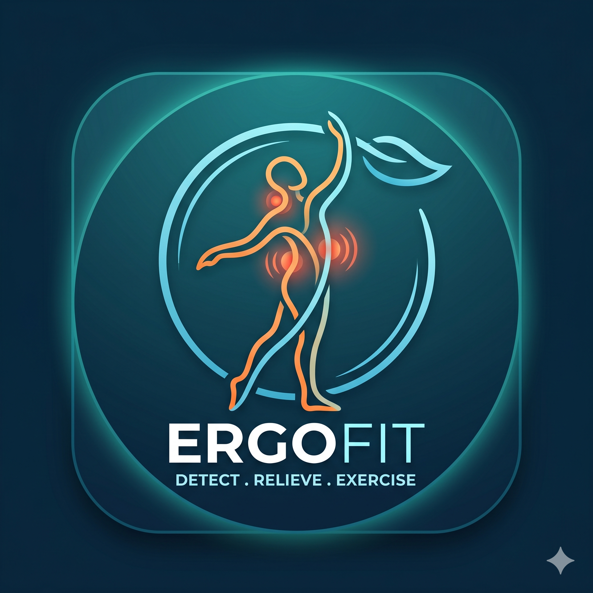

<p align="center">
  
</p>

<h1 align="center">ErgoWorkCoach</h1>

<p align="center">
  Aplicación multiplataforma de autocuidado laboral con ejercicios guiados,
  registro de dolor y selección corporal interactiva.
</p>

<p align="center">
  
  
  
  
</p>

## Descripción

ErgoWorkCoach ayuda a registrar molestias musculoesqueléticas y entrega una
rutina de autocuidado según la zona corporal y el nivel de dolor informado. La
experiencia combina un mapa humano 3D, demostraciones en video de personas
reales, respiración guiada, seguimiento de progreso, avatar y gamificación.

El proyecto está construido con Flutter y mantiene una arquitectura modular por
funcionalidad. Actualmente utiliza persistencia local, por lo que puede
ejecutarse sin configurar un backend.

## Funcionalidades

| Módulo | Implementación actual |
| --- | --- |
| Mapa corporal 3D | 27 regiones seleccionables, vista frontal/posterior, rotación por arrastre y resaltado de la zona elegida |
| Registro de dolor | Selección de zona, tipo de molestia e intensidad mediante escala EVA |
| Ejercicios guiados | 66 ejercicios asociados a 35 videos de personas reales realizando los movimientos |
| Reproducción | Video integrado desde la fuente HTTPS original, con controles y alternativa para abrirlo externamente |
| Respiración | Sesiones guiadas con temporizador y estados controlados mediante BLoC |
| Progreso | Experiencia, niveles, logros, rachas y personalización de avatar |
| Sesión | Onboarding, acceso local persistente y cierre de sesión |

## Videos de ejercicios

Las demostraciones no usan fotografías ni dibujos como sustituto del
movimiento. Cada ejercicio abre un video con una persona real, muestra su
procedencia y conserva una alternativa de reproducción cuando el contenido no
puede integrarse en la aplicación.

Los videos se transmiten desde sus proveedores originales, no forman parte del
repositorio y requieren conexión a internet. La asignación se centraliza en
[`exercise_media_catalog.dart`](lib/features/pain/presentation/widgets/exercise_media_catalog.dart)
y su trazabilidad se documenta en
[`VIDEO_SOURCES.md`](assets/images/exercises/VIDEO_SOURCES.md).

## Tecnologías

- Flutter y Dart para Android, iOS, Web y Windows.
- `flutter_bloc` y `equatable` para estado predecible.
- `go_router` para navegación y `get_it` para inyección de dependencias.
- `SharedPreferences` para persistencia local.
- Three.js y un modelo GLB local para el mapa corporal interactivo.
- `youtube_player_iframe` y WebView para las demostraciones en video.

## Puesta en marcha

Requisitos: Flutter 3.38 o posterior, Dart 3 y un dispositivo, emulador o
navegador compatible.

```bash
git clone https://github.com/rgonzalez1043/apkergonomia.git
cd apkergonomia
flutter pub get
flutter run
```

Para seleccionar un destino concreto:

```bash
flutter devices
flutter run -d <device-id>
```

## Verificación

```bash
flutter analyze
flutter test
flutter build web --release --no-wasm-dry-run
flutter build apk --debug
```

La versión actual se verificó sin hallazgos del analizador, con 12 pruebas
aprobadas y compilaciones correctas para Web y Android.

## Estructura

```text
lib/
|-- config/          # rutas, tema e inyección de dependencias
|-- core/            # contratos, errores, constantes y utilidades
`-- features/        # auth, avatar, breathing, gamification, home,
                     # onboarding, pain y settings
assets/
|-- models/          # modelo anatómico GLB
|-- three/           # visor 3D, dependencias locales y licencias
`-- images/          # recursos visuales y registro de fuentes
test/                # pruebas de dominio, estado, catálogo y UI
tooling/             # utilidades locales de mantenimiento
```

## Documentación

- [`AUDIT_REPORT.md`](AUDIT_REPORT.md): revisión funcional y técnica del proyecto.
- [`CHANGELOG.md`](CHANGELOG.md): cambios relevantes por versión.
- [`VIDEO_SOURCES.md`](assets/images/exercises/VIDEO_SOURCES.md): fuentes y protocolo de revisión de videos.
- [`assets/three/README.md`](assets/three/README.md): implementación y licencia del mapa 3D.

## Estado antes de producción

La autenticación y los datos de usuario son locales y están pensados para esta
etapa del producto. Antes de una publicación comercial se debe incorporar un
servicio de identidad, almacenamiento seguro, políticas de privacidad,
telemetría con consentimiento y firma de distribución.

El catálogo de ejercicios y sus dosis también requieren validación final por un
profesional de fisioterapia, además de una revisión periódica de disponibilidad,
licencia e idoneidad de cada video externo.

## Alcance de salud

ErgoWorkCoach entrega orientación general de autocuidado. No diagnostica, no
prescribe tratamientos y no reemplaza una evaluación médica o de fisioterapia.
El usuario debe detener el ejercicio si el dolor aumenta o aparecen mareos,
hormigueo, debilidad u otros síntomas preocupantes.
